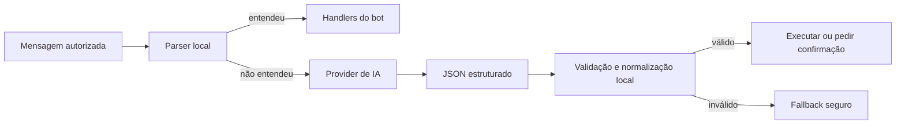

# Bot Finanças WhatsApp

[](https://nodejs.org/)
[](https://github.com/WhiskeySockets/Baileys)
[](https://www.sqlite.org/)
[](https://vitest.dev/)
[](#status-e-vers%C3%A3o)
[](#ia-interpretadora-segura)
[](https://github.com/samira1406/bot-fincanceiro/actions/workflows/test.yml)

Assistente financeiro para WhatsApp com registro de entradas e gastos,
consultas, metas, exportações e painel administrativo. O projeto combina um
parser local prioritário com uma camada opcional de IA que somente interpreta
mensagens para JSON validado.

> [!IMPORTANT]
> O projeto está em beta controlado. Não é um produto financeiro regulamentado
> e não deve ser usado como única fonte para decisões financeiras críticas.

## Visão geral

O Bot Finanças transforma mensagens do WhatsApp em lançamentos financeiros
organizados. Ele aceita comandos objetivos, linguagem natural e erros comuns de
digitação, mantendo confirmação obrigatória quando houver ambiguidade.

O acesso pode ser limitado por número, JID e grupo. Pessoas não autorizadas
permanecem silenciosas e não provocam chamadas à IA, gravações ou exportações.

## Funcionalidades principais

| Área | Recursos |
|---|---|
| Finanças | Entradas, gastos, saldo, resumo, histórico e fechamento mensal |
| Organização | Categorias canônicas, metas mensais e alertas |
| Consultas | Períodos, categorias, maior gasto e rankings |
| Exportação | CSV e planilha XLSX |
| Operação | Painel administrativo, health check, logs e rate limiting |
| Segurança | Beta fechado, isolamento por usuário e pendências confirmadas |
| IA opcional | Gemini ou OpenAI como interpretador estruturado |
| Continuidade | SQLite, migrations, backups e execução com PM2 |
| Qualidade | Testes automatizados com Vitest |

## Exemplos de conversa

```text
Usuário: gstei 35 no mercd
Bot: Despesa registrada: R$ 35,00 em Mercado.

Usuário: receebi 1250 de frila
Bot: Receita registrada: R$ 1.250,00 em Freelance.

Usuário: qnt foi ifod esse mes
Bot: Você gastou R$ 47,00 em Ifood neste mês.

Usuário: 1250
Bot: Entendi o valor R$ 1.250,00, mas preciso saber o tipo.
     1 - Entrada
     2 - Gasto
```

Os valores acima são exemplos fictícios.

## IA interpretadora segura

A IA não conversa livremente, não escreve diretamente no banco e não escolhe
ações por conta própria. O fluxo é:



- O parser local sempre tem prioridade.
- Valores precisam existir na mensagem original.
- Intents, métricas, períodos e categorias são normalizados localmente.
- Confiança média e termos ambíguos exigem confirmação.
- Timeout, erro do provider ou JSON inválido preservam o fallback anterior.
- Logs da IA são sanitizados e nunca devem conter chaves.

Veja [Arquitetura](docs/ARCHITECTURE.md) e
[Segurança](docs/SECURITY.md).

## Segurança e beta fechado

O modo recomendado para testes controlados usa:

```env
BETA_MODE=true
BETA_BLOCKED_REPLY=false
BETA_DEBUG=false
BETA_DEBUG_SHOW_RAW=false
WHATSAPP_MENU_MODE=text
AI_LOG_RAW=false
```

Autorizações podem ser configuradas por:

- `BETA_ALLOWED_NUMBERS`;
- `BETA_ALLOWED_JIDS`, inclusive identificadores `@lid`;
- `BETA_ALLOWED_GROUPS`;
- `BETA_GROUP_REQUIRE_AUTHORIZED_PARTICIPANT`.

Com `BETA_BLOCKED_REPLY=false`, contatos não autorizados não recebem resposta,
não são cadastrados e não chamam a IA.

Nunca envie `.env`, chaves, tokens, arquivos de `auth/` ou banco de dados para
issues, commits ou screenshots.

## Instalação local

### Requisitos

- Node.js 24.x;
- npm;
- WhatsApp disponível para leitura do QR Code;
- compilador compatível com dependências nativas, se solicitado pelo sistema.

### Windows

```powershell
git clone https://github.com/samira1406/bot-fincanceiro.git
cd bot-fincanceiro
npm.cmd install
Copy-Item .env.example .env
npm.cmd test
npm.cmd start
```

### Linux ou macOS

```bash
git clone https://github.com/samira1406/bot-fincanceiro.git
cd bot-fincanceiro
npm install
cp .env.example .env
npm test
npm start
```

Edite o `.env` local antes de iniciar. O arquivo real não deve ser commitado.

## Configuração

O arquivo [.env.example](.env.example) documenta todas as opções por bloco:

- WhatsApp e menus;
- regras financeiras e comportamento;
- beta fechado;
- OpenAI e Gemini;
- painel administrativo;
- banco, backup e logs.

Para o primeiro teste, mantenha a IA desligada e configure um token forte para
o painel. Ative o provider somente depois de validar o parser local.

## Comandos úteis

| Objetivo | Windows | Linux/macOS |
|---|---|---|
| Instalar | `npm.cmd install` | `npm install` |
| Iniciar | `npm.cmd start` | `npm start` |
| Desenvolvimento | `npm.cmd run dev` | `npm run dev` |
| Testar | `npm.cmd test` | `npm test` |
| Cobertura | `npm.cmd run test:cover` | `npm run test:cover` |
| Backup manual | `npm.cmd run backup` | `npm run backup` |

## Execução com PM2

```bash
npm install -g pm2
pm2 start ecosystem.config.cjs
pm2 save
pm2 status
```

O processo usa uma instância, reinício automático e arquivos de log em
`logs/`. Consulte o [guia de deploy](docs/DEPLOY.md) antes de usar uma VPS.

## Painel administrativo

O painel protegido por token fica, por padrão, em:

```text
http://localhost:3000/admin
```

O endpoint público `/health` retorna apenas informações mínimas. Não exponha o
painel diretamente à internet sem firewall, HTTPS e controle de acesso.

## Documentação

| Guia | Conteúdo |
|---|---|
| [Roadmap](docs/ROADMAP.md) | Fases concluídas e próximos marcos |
| [Deploy](docs/DEPLOY.md) | Ambiente local, PM2 e VPS/Oracle Cloud |
| [Segurança](docs/SECURITY.md) | Segredos, WhatsApp, banco, IA e incidentes |
| [Beta test](docs/BETA_TEST.md) | Roteiro e critérios de aprovação |
| [Changelog](docs/CHANGELOG.md) | Evolução do ciclo beta |
| [Arquitetura](docs/ARCHITECTURE.md) | Componentes e ordem de prioridade |
| [Solução de problemas](docs/TROUBLESHOOTING.md) | Erros frequentes e diagnóstico |

## Screenshots

Capturas reais do WhatsApp e do painel serão adicionadas em `docs/assets/`
quando houver material revisado e completamente anonimizado. Nenhuma imagem
fictícia foi criada para esta documentação.

## Roadmap resumido

- Consolidar o beta fechado com testers convidados.
- Validar recuperação de backup e operação contínua em VPS.
- Preparar deploy controlado em Oracle Cloud ou infraestrutura equivalente.
- Melhorar observabilidade e documentação operacional.
- Avaliar monetização somente após segurança, estabilidade e validação do beta.

Detalhes em [ROADMAP.md](docs/ROADMAP.md).

## Status e versão

O repositório é apresentado como **Beta v0.5.5**, correspondente ao ciclo atual
de segurança, Gemini e normalização canônica.

O `package.json` permanece em `3.0.0` porque representa a base técnica original
do projeto privado e é usado pelos processos atuais. Essa versão não significa
que o bot esteja em produção. A diferença é documentada para evitar alteração
desnecessária em scripts e automações.

## Avisos

- Use dados fictícios durante o beta.
- Revise lançamentos e exportações antes de tomar decisões.
- Não publique números, JIDs, QR Codes, tokens ou mensagens privadas.
- Não exponha o painel sem proteção de rede.
- Faça backups e teste a restauração periodicamente.
- Baileys é uma integração não oficial com o WhatsApp.

## Contribuição

Antes de abrir uma issue, consulte
[TROUBLESHOOTING.md](docs/TROUBLESHOOTING.md). Relatos de bug nunca devem
conter segredos ou dados reais. Pull requests devem manter os testes verdes e
seguir o checklist de segurança do repositório.
