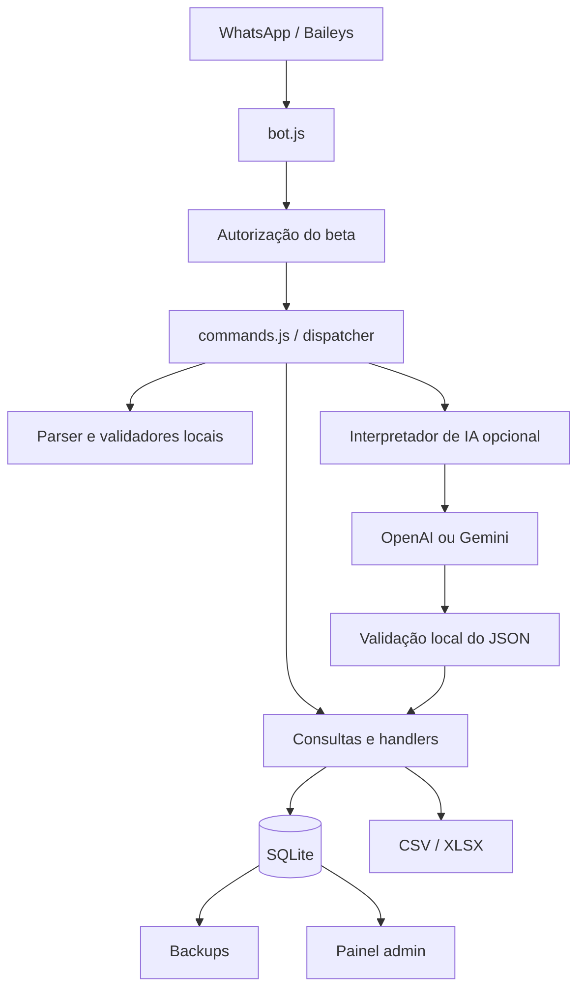
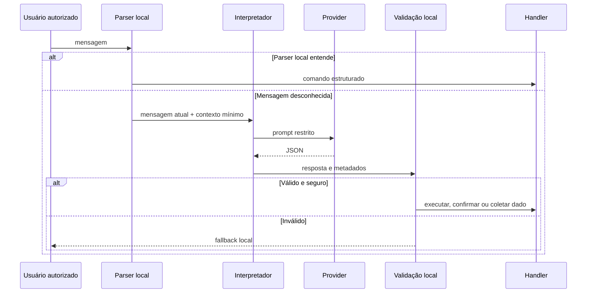

# Arquitetura

## Visão geral

O projeto é uma aplicação Node.js de processo único. Baileys recebe mensagens,
o dispatcher aplica prioridades e os módulos de domínio executam ações sobre
SQLite.



## Ordem de prioridade

A ordem impede que respostas curtas sejam confundidas com novos valores ou
categorias:

1. autorização do beta;
2. cancelamento global;
3. confirmação ou estado pendente da IA;
4. avaliação, reset, edição, exclusão e demonstração;
5. lançamento pendente;
6. onboarding;
7. comandos exatos e consultas locais;
8. parser financeiro local;
9. classificação de fallback;
10. IA opcional;
11. resposta final de ajuda.

Não autorizados são interrompidos antes de cadastro, banco, exportação ou IA.

## Componentes principais

| Módulo | Responsabilidade |
|---|---|
| `src/bot.js` | Conexão Baileys, eventos e pré-autorização |
| `src/commands.js` | Dispatcher e handlers de conversa |
| `src/validators.js` | Parser local e validação de comandos |
| `src/categoryRules.js` | Categorias canônicas e aliases |
| `src/financeQueries.js` | Consultas e agregações financeiras |
| `src/database.js` | Persistência SQLite |
| `src/pending*.js` | Estados temporários isolados por usuário |
| `src/aiInterpreter.js` | Timeout, logs e fallback da IA |
| `src/aiProviders/` | Adaptadores OpenAI e Gemini |
| `src/aiValidation.js` | Schema, normalização e decisão segura |
| `src/web/painel.js` | Painel e APIs administrativas |
| `src/backup.js` | Backup e retenção |
| `src/scheduler.js` | Lembretes, alertas e backup agendado |

## Dados

SQLite armazena usuários, lançamentos, metas, feedback e eventos necessários ao
produto. O caminho vem de `DATABASE_PATH`.

As pastas abaixo são dados operacionais, não código:

```text
auth/
database/
database/backups/
logs/
exports/
```

Elas devem permanecer fora do Git e em disco persistente no deploy.

## Estados pendentes

Pendências são mantidas em mapas por usuário e possuem expiração:

- onboarding;
- tipo e categoria de lançamento;
- confirmação da IA;
- edição e exclusão;
- reset;
- feedback e avaliação do beta.

Uma pendência ativa tem prioridade sobre o parser normal. Isso evita que `1`,
`2` ou um valor sejam interpretados fora do contexto.

## Interpretador de IA



A IA não recebe acesso ao banco e não chama handlers diretamente.

## Providers

- OpenAI usa structured outputs com JSON Schema.
- Gemini usa `generateContent` com MIME JSON.
- A seleção é feita por `AI_PROVIDER`.
- Não existe fallback automático entre providers.
- Erros sempre retornam ao fluxo local.

## Painel

O painel Express oferece:

- health check público e mínimo;
- status operacional;
- métricas agregadas;
- configuração do beta sem expor whitelist;
- backups recentes;
- feedback e eventos;
- exportações protegidas.

Rotas administrativas exigem token.

## Backup

O módulo de backup usa a API do SQLite, grava em `BACKUP_DIR` e remove arquivos
mais antigos conforme `BACKUP_MANTER_DIAS`. A criação do backup não substitui o
teste de restauração.

## Testes

Vitest cobre parsers, comandos, estados, banco, exportadores, painel, IA,
segurança do beta e regressões. O workflow do GitHub executa a mesma suíte usada
localmente.
